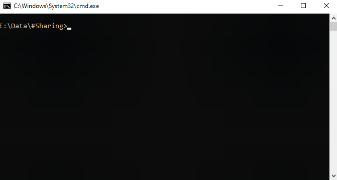

# Sharer

A very simple program that allows for the sharing of data over the internet using HTTP or HTTPS

## Usage

Running the program will create a folder named **root** in the current directory.

All files in said directory will be accessible over the web.

The port **25565**, or any desired port, will have to be port forwarded for access over the web.


### Command line

This program also supports command-line flag parsing, with a total of 3 supported flags.




The command below sets the directory to *folder_name*, the port to *30000* and enables TLS:
```
main.exe -d ./folder_name -p 30000 -tls
```

Its possible to run ``main.exe -help`` to get additional support.


## HTTPS

This program supports HTTPS and you're able to generate the needed keeps with [OpenSSL](https://www.openssl.org/) with the following two commands and following their instructions:

```
openssl req -x509 -newkey rsa:4096 -keyout encPrivateKey.pem -out cert.pem -days 1000
openssl rsa -in encPrivateKey.pem -out key.pem
```